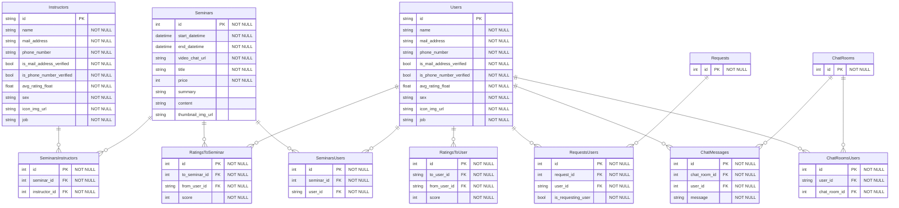

```mermaid
erDiagram
  Instructors ||--o{ SeminarsInstructors: ""
  Instructors{
    string id PK
    string name "NOT NULL"
    string mail_address "NOT NULL"
    string phone_number "NOT NULL"
    bool is_mail_address_verified "NOT NULL"
    bool is_phone_number_verified "NOT NULL"
    float avg_rating_float "NOT NULL"
    string sex "NOT NULL"
    string icon_img_url "NOT NULL"
    string job "NOT NULL"
  }

  Seminars ||--o{ SeminarsInstructors: ""
  Seminars ||--o{ RatingsToSeminar: ""
  Seminars ||--o{ SeminarsUsers: ""
  Seminars{
    int id PK "NOT NULL"
    datetime start_datetime "NOT NULL"
    datetime end_datetime "NOT NULL"
    string video_chat_url "NOT NULL"
    string title "NOT NULL"
    int price "NOT NULL"
    string summary
    string content
    string thumbnail_img_url
  }
  SeminarsInstructors{
    int id PK "NOT NULL"
    int seminar_id FK "NOT NULL"
    int instructor_id FK "NOT NULL"
  }
  RatingsToSeminar{
    int id PK "NOT NULL"
    int to_seminar_id FK "NOT NULL"
    string from_user_id FK "NOT NULL"
    int score "NOT NULL"
  }
  SeminarsUsers{
    int id PK "NOT NULL"
    int seminar_id FK "NOT NULL"
    string user_id FK "NOT NULL"
  }

  Users ||--o{ SeminarsUsers: ""
  Users ||--o{ RatingsToSeminar: ""
  Users ||--o{ RatingsToUser: ""
  Users ||--o{ RequestsUsers: ""
  Users ||--o{ ChatMessages: ""
  Users ||--o{ ChatRoomsUsers: ""
  Users{
    string id PK
    string name "NOT NULL"
    string mail_address "NOT NULL"
    string phone_number "NOT NULL"
    bool is_mail_address_verified "NOT NULL"
    bool is_phone_number_verified "NOT NULL"
    float avg_rating_float "NOT NULL"
    string sex "NOT NULL"
    string icon_img_url "NOT NULL"
    string job "NOT NULL"
  }
  RatingsToUser{
    int id PK "NOT NULL"
    string to_user_id FK "NOT NULL"
    string from_user_id FK "NOT NULL"
    int score "NOT NULL"
  }
  RequestsUsers{
    int id PK "NOT NULL"
    int request_id FK "NOT NULL"
    string user_id FK "NOT NULL"
    bool is_requesting_user "NOT NULL"
  }
  ChatMessages{
    int id PK "NOT NULL"
    int chat_room_id FK "NOT NULL"
    int user_id FK "NOT NULL"
    string message "NOT NULL"
  }
  ChatRoomsUsers{
    int id PK "NOT NULL"
    string user_id FK "NOT NULL"
    int chat_room_id FK "NOT NULL"
  }

  Requests ||--o{ RequestsUsers: ""
  ChatRooms ||--o{ ChatRoomsUsers: ""
  ChatRooms ||--o{ ChatMessages: ""
  Requests{
    int id PK "NOT NULL"
  }
  ChatRooms{
    int id PK "NOT NULL"
  }
```
